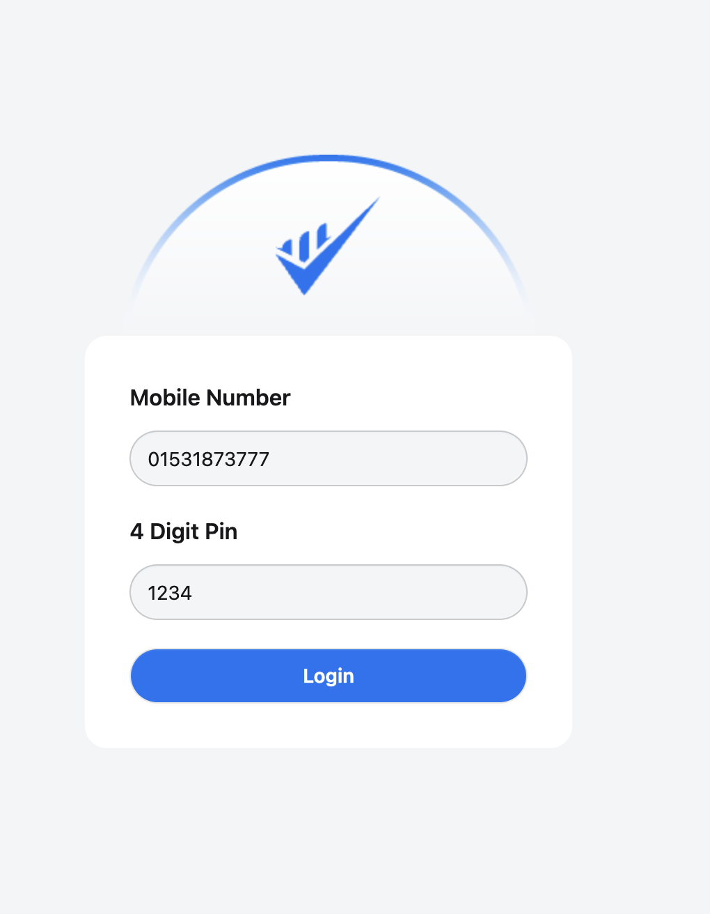
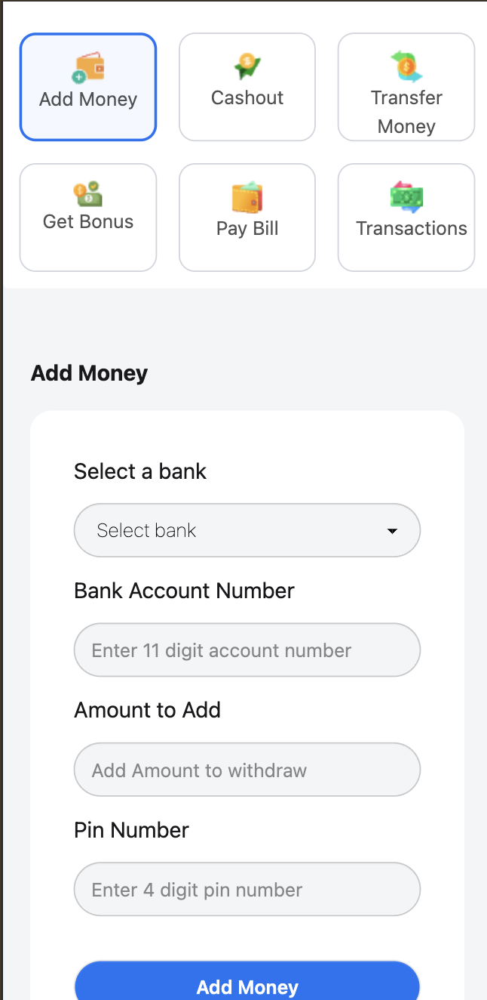

💳 Mobile Banking Web Application

Live Link: https://chyaiman.github.io/mobile-banking-javascript-project/home.html

A front-end simulation of a mobile banking app built with HTML, CSS, JavaScript, Tailwind, and DaisyUI.
This project mimics core banking features like adding money, cashing out, transferring funds, paying bills, and tracking transaction history — all within a responsive, modern interface.

🚀 Features

🔐 Login System: Users log in with a mobile number and a 4-digit PIN.

💰 Balance Tracking: Real-time balance updates after transactions.

➕ Add Money: Simulate deposits with bank/account number validation.

💸 Cash Out: Withdraw money securely with PIN verification.

🔄 Transfer Money: Transfer funds between accounts with number and PIN checks.

📑 Pay Bills: Simulated bill payments through various banks.

🎁 Get Bonus: Enter bonus coupons to simulate promotions.

📜 Transaction History: Logs every action (Add Money, Transfer, Pay Bill, etc.) with timestamps.

🎨 Modern UI: Responsive design using Tailwind CSS and DaisyUI components.

🛠️ Technologies Used

HTML5

CSS3 (Tailwind CSS, DaisyUI)

JavaScript (ES6+)

Font Awesome (icons)

🔑 Demo Credentials

To test the app, use the following credentials during login:

Mobile Number: 12345678910 (any 11-digit number works)

PIN: 1234
## 📸 Screenshots  

### 🔐 Login Page  
  

### 🏦 User Interface  
  

### 💵 Add Money Feature  
  

### 📑 Transaction History  
  

